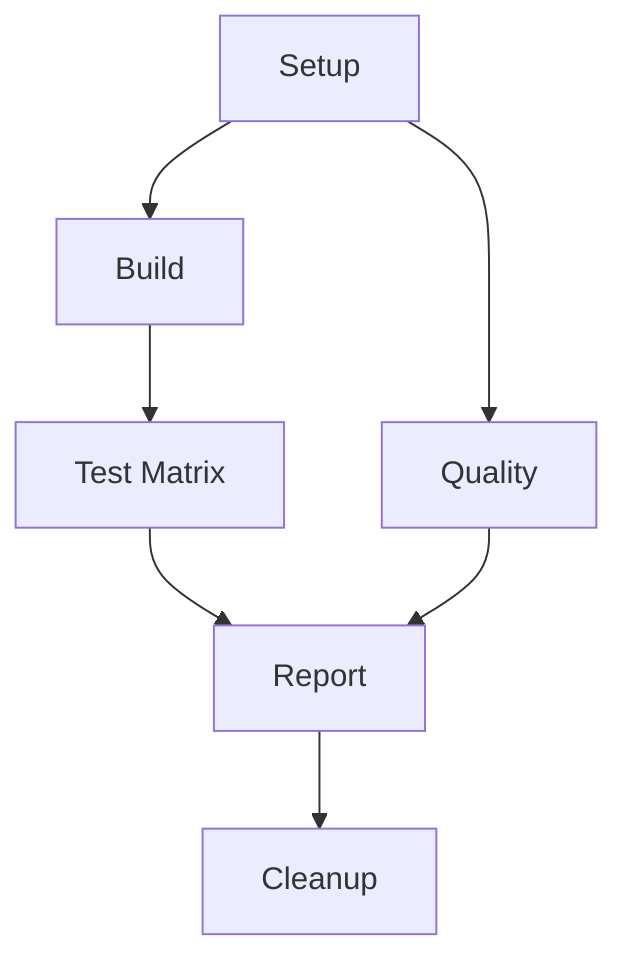

# CI/CD Robust Workflow Documentation

## Overview

The `ci-robust.yml` workflow has been designed to provide maximum reliability and information gathering even when individual components fail or are unavailable. This document outlines the key improvements and design decisions.

## Key Features

### 1. Robust Environment Setup
- **Script Integration**: Uses `scripts/setup-ci-env.sh` for consistent, error-tolerant environment setup
- **Capability Detection**: Automatically detects and reports available tools and dependencies
- **Graceful Degradation**: Continues execution even when optional components are missing
- **Cache Optimization**: Intelligent caching based on script content hashes

### 2. Improved Error Handling
- **Continue-on-Error**: Jobs marked with `continue-on-error: true` to prevent complete pipeline failures
- **Fallback Mechanisms**: Alternative execution paths when primary tools are unavailable
- **Comprehensive Logging**: Detailed logging for troubleshooting even when components fail

### 3. Enhanced Test Execution
- **Test Wrapper Integration**: Uses `scripts/test-wrapper.sh` for robust test execution
- **Matrix Strategy**: Parallel execution across test categories (unit, integration, e2e, performance, coverage)
- **Flexible Results**: Generates meaningful reports even when tests are skipped or limited

### 4. Smart Caching System
- **Composite Cache Keys**: Based on script content hashes to ensure cache validity
- **Multi-level Fallback**: Progressive cache key matching for maximum hit rate
- **Environment Preservation**: Caches setup state across jobs

## Workflow Structure



### Job Breakdown

#### 1. Setup Job
- **Purpose**: Environment preparation and capability detection
- **Outputs**: System capabilities, cache keys, change detection
- **Key Features**:
  - Runs `setup-ci-env.sh` with error handling
  - Generates capability report (JSON)
  - Creates optimized cache strategy

#### 2. Build Job
- **Purpose**: Compile kernel modules and user-space components
- **Dependencies**: Setup job
- **Key Features**:
  - Attempts kernel module build with header detection
  - Fallback to user-space components only
  - Comprehensive artifact collection

#### 3. Test Jobs (Matrix)
- **Purpose**: Execute comprehensive test suite
- **Strategy**: Parallel execution across categories
- **Key Features**:
  - Uses `test-wrapper.sh` for robust test execution
  - Category-specific timeout and retry logic
  - Generates JUnit XML and JSON reports

#### 4. Quality Job
- **Purpose**: Code quality analysis and formatting checks
- **Key Features**:
  - Static analysis with cppcheck (if available)
  - Format checking with clang-format
  - Continues with warnings rather than failing

#### 5. Report Job
- **Purpose**: Aggregate results and generate comprehensive reports
- **Key Features**:
  - Collects all artifacts and results
  - Generates JSON report with full pipeline state
  - Creates markdown summary for PR comments
  - Provides step-by-step summary in Actions UI

#### 6. Cleanup Job
- **Purpose**: Resource cleanup and housekeeping
- **Always Runs**: Even if previous jobs fail

## Error Handling Strategy

### Levels of Graceful Degradation

1. **Component Missing**: Skip component, continue with available alternatives
2. **Build Failure**: Report warning, continue with testing available artifacts
3. **Test Failure**: Report failure, continue with other test categories
4. **Tool Missing**: Use fallback tools or skip optional analysis

### Example Error Scenarios and Responses

| Scenario | Response |
|----------|----------|
| Kernel headers missing | Skip kernel build, continue with user-space |
| cppcheck unavailable | Skip static analysis, report warning |
| Test files missing | Mark category as skipped, continue others |
| Docker unavailable | Skip containerized tests, run native tests |
| Memory pressure | Reduce parallelism, increase timeouts |

## Cache Strategy

### Cache Keys Structure
```
robust-ci-v2-ubuntu-22.04-{script-hash}
```

### Cached Components
- CI environment setup state
- Python packages and dependencies
- APT package cache
- Build tools and compilers

### Cache Invalidation
- Script content changes trigger cache invalidation
- Version bumps force fresh environment
- Weekly automatic cache refresh

## Reporting and Visibility

### Generated Reports
1. **Capability Report** (`ci-capabilities.json`): System capabilities and limitations
2. **Comprehensive Report** (`ci-comprehensive-report.json`): Complete pipeline state
3. **Markdown Summary** (`CI_PIPELINE_SUMMARY.md`): Human-readable results
4. **Step Summaries**: Real-time progress in GitHub Actions UI

### Artifact Organization
```
ci-capabilities-report/
├── ci-capabilities.json
build-artifacts/
├── build/
├── *.ko
├── drivers/
test-results-{category}/
├── test-results/
├── coverage/
quality-results/
├── lint-results/
ci-comprehensive-report/
├── ci-comprehensive-report.json
├── CI_PIPELINE_SUMMARY.md
```

## Usage Instructions

### Manual Triggers
The workflow supports manual dispatch with optional test category selection:

```yaml
workflow_dispatch:
  inputs:
    test_category:
      description: 'Specific test category to run'
      required: false
      default: 'all'
      type: choice
      options:
      - all
      - unit
      - integration
      - e2e
      - performance
      - coverage
```

### Integration with Existing Scripts

The workflow integrates with:
- `scripts/setup-ci-env.sh`: Robust environment setup
- `scripts/test-wrapper.sh`: Comprehensive test execution
- `scripts/*.sh`: All build and utility scripts

### Monitoring and Debugging

1. **Check Capability Report**: First artifact to understand environment limitations
2. **Review Step Summaries**: Real-time progress and issues
3. **Examine Job Logs**: Detailed execution information
4. **Download Artifacts**: Complete results and intermediate files

## Best Practices for Maintenance

### Script Updates
- Update cache version when making significant script changes
- Test scripts locally before committing
- Ensure backward compatibility for fallback scenarios

### Adding New Test Categories
1. Update matrix in workflow
2. Add category to `test-wrapper.sh`
3. Ensure proper dependency detection
4. Test with missing dependencies

### Troubleshooting Common Issues

#### Cache Problems
```bash
# Force cache refresh by updating version
env:
  CACHE_VERSION: v3  # Increment version
```

#### Environment Issues
```bash
# Check capability report
cat ci-capabilities.json | jq '.capabilities'
```

#### Test Failures
```bash
# Run test wrapper locally
bash scripts/test-wrapper.sh --category unit --verbose
```

## Performance Considerations

### Optimization Strategies
1. **Parallel Execution**: Matrix strategy for test categories
2. **Smart Caching**: Reduces setup time from ~5 minutes to ~30 seconds
3. **Selective Execution**: Path-based filtering to skip unnecessary runs
4. **Resource Management**: Cleanup job prevents resource leaks

### Typical Execution Times
- **Setup**: 30 seconds (cached) / 5 minutes (fresh)
- **Build**: 2-5 minutes (depending on components)
- **Tests**: 3-10 minutes per category (parallel)
- **Quality**: 1-2 minutes
- **Report**: 30-60 seconds
- **Total**: 8-25 minutes (depending on cache state and failures)

## Security Considerations

### Permissions
```yaml
permissions:
  contents: write      # For artifact upload and release creation
  security-events: write  # For SARIF upload (if security scanning added)
  actions: read        # For workflow introspection
  checks: write        # For test result publishing
  pull-requests: write # For PR comments
```

### Secret Management
- No hardcoded secrets in workflow
- Uses GitHub-provided tokens where possible
- Secure artifact handling

### Input Validation
- Controlled input options for manual dispatch
- Path filtering to prevent malicious triggers
- Timeout controls to prevent resource exhaustion

## Future Enhancements

### Planned Improvements
1. **Adaptive Resource Allocation**: Adjust parallelism based on runner capacity
2. **Intelligent Retry Logic**: Retry failed tests with backoff
3. **Performance Trending**: Track execution time and success rates over time
4. **Integration Testing**: Enhanced cross-component testing
5. **Security Scanning**: Integrated security analysis with SARIF reporting

### Extensibility
The workflow is designed to be easily extended:
- Add new test categories by updating the matrix
- Integrate additional tools by updating setup scripts
- Add new report formats by extending the report job
- Include additional quality checks by updating the quality job

## Conclusion

The robust CI workflow provides a foundation for reliable, informative continuous integration that adapts to various environment constraints while maintaining comprehensive testing and reporting capabilities. Its design philosophy of "maximum information with graceful degradation" ensures that development teams always get useful feedback, even when working in constrained environments.