# Testing Best Practices for Linux Kernel Drivers

## 📋 Overview

This document outlines industry-standard testing practices specifically tailored for Linux kernel driver development, with focus on the MPU-6050 driver project. These practices ensure reliability, maintainability, and compliance with kernel standards.

## 🏗️ Test Pyramid Methodology

### The Kernel Driver Test Pyramid

```
                     /\
                    /  \
                   /    \
                  /  E2E  \  ←  5%  Hardware Integration Tests
                 /        \
                /----------\
               /            \
              /              \  
             /  Integration   \  ← 20%  Component Integration Tests
            /                 \
           /-------------------\
          /                     \
         /                       \
        /      Unit Tests         \  ← 75%  Unit Tests with Mocks
       /_________________________\

Test Distribution for Kernel Drivers:
- Unit Tests (75%): Fast, isolated, deterministic
- Integration Tests (20%): Component interaction testing
- End-to-End Tests (5%): Real hardware validation
```

### Test Types and Purposes

| Test Type | Purpose | Scope | Speed | Hardware Required |
|-----------|---------|--------|-------|-------------------|
| **Unit Tests** | Logic validation | Single function/module | Fast (< 1ms) | No |
| **Integration Tests** | Component interaction | Multiple modules | Medium (< 100ms) | Mock/Simulator |
| **Hardware Tests** | Real device validation | Full system | Slow (> 1s) | Yes |
| **Regression Tests** | Prevent breaking changes | All components | Variable | Mixed |
| **Performance Tests** | Timing validation | Critical paths | Medium | Mock/Real |

## 🎯 Coverage Targets by Component Type

### Component-Specific Coverage Standards

```yaml
Coverage Targets by Component:

Core Driver Logic:
  Line Coverage:     95%+  # Critical business logic
  Branch Coverage:   92%+  # All decision paths
  Function Coverage: 98%+  # Nearly all functions tested
  MCDC Coverage:     85%+  # Modified Condition/Decision Coverage

Hardware Interface (I2C/SPI):
  Line Coverage:     88%+  # Hardware abstraction
  Branch Coverage:   85%+  # Error path handling
  Function Coverage: 95%+  # Communication functions
  Path Coverage:     80%+  # All communication paths

User Interface (sysfs/chardev):
  Line Coverage:     85%+  # User interaction paths
  Branch Coverage:   80%+  # Input validation
  Function Coverage: 92%+  # Interface functions
  Error Coverage:    95%+  # All error scenarios

Utility/Helper Functions:
  Line Coverage:     90%+  # Supporting functions
  Branch Coverage:   87%+  # Helper logic
  Function Coverage: 100%+ # All utilities tested

Test Code Itself:
  Line Coverage:     98%+  # Test quality assurance
  Branch Coverage:   95%+  # Test completeness
  Function Coverage: 100%+ # All test functions
```

### Quality Gates by Coverage Level

| Coverage Level | Quality Gate | Action |
|----------------|--------------|---------|
| **< 70%** | 🚨 **CRITICAL** | Block PR, mandatory improvement |
| **70-84%** | ⚠️ **WARNING** | Review required, improvement plan |
| **85-94%** | ✅ **ACCEPTABLE** | Merge allowed, monitor trends |
| **95%+** | 🏆 **EXCELLENT** | Gold standard, maintain quality |

## 🧪 Test Categories and When to Use Them

### 1. Unit Tests (75% of total tests)

**Purpose**: Test individual functions in isolation

**When to Use:**
- Testing pure functions without side effects
- Validating calculation logic
- Testing error handling paths
- Verifying state machine transitions

**Example:**
```c
// Test: mpu6050_scale_accel_data()
void test_accel_scaling_positive_values(void) {
    // Arrange
    int16_t raw_x = 1000, raw_y = 2000, raw_z = 3000;
    uint8_t range = MPU6050_ACCEL_RANGE_2G;
    
    // Act
    struct mpu6050_scaled_data result = mpu6050_scale_accel_data(raw_x, raw_y, raw_z, range);
    
    // Assert
    CU_ASSERT_EQUAL(result.x, 122);  // Expected scaled value
    CU_ASSERT_EQUAL(result.y, 244);
    CU_ASSERT_EQUAL(result.z, 366);
}
```

**Best Practices:**
- Use mocks for hardware dependencies
- Test one thing per test case
- Use descriptive test names
- Test edge cases and boundary conditions
- Maintain 1:1 ratio of test code to production code

### 2. Integration Tests (20% of total tests)

**Purpose**: Test component interactions and data flow

**When to Use:**
- Testing I2C communication with mocked hardware
- Validating sysfs attribute operations
- Testing character device IOCTL sequences
- Verifying error propagation between layers

**Example:**
```c
// Test: I2C communication with device simulation
void test_i2c_read_with_device_error(void) {
    // Arrange
    mock_i2c_set_response(I2C_ERROR_NACK);
    struct mpu6050_priv *priv = create_test_device();
    
    // Act
    int result = mpu6050_read_register(priv, MPU6050_REG_WHO_AM_I);
    
    // Assert
    CU_ASSERT_EQUAL(result, -EIO);
    CU_ASSERT_TRUE(mock_i2c_error_logged());
}
```

### 3. End-to-End Tests (5% of total tests)

**Purpose**: Validate complete system functionality with real hardware

**When to Use:**
- CI/CD pipeline validation
- Release qualification testing
- Hardware compatibility verification
- Performance benchmarking

**Example:**
```bash
#!/bin/bash
# Hardware-in-the-loop test
test_real_hardware_data_acquisition() {
    # Load driver
    insmod build/mpu6050.ko
    
    # Verify device detection
    [ -f /sys/class/mpu6050/mpu6050/status ] || fail "Device not detected"
    
    # Test data acquisition
    for i in {1..100}; do
        accel_data=$(cat /sys/class/mpu6050/mpu6050/accel_data)
        [ -n "$accel_data" ] || fail "No data on iteration $i"
    done
    
    # Unload driver
    rmmod mpu6050
}
```

## 🛡️ Quality Gates and CI/CD Integration

### Pre-Commit Quality Gates

```yaml
Pre-Commit Hooks:
  1. Code Formatting:
     - Tool: clang-format
     - Config: .clang-format (Linux kernel style)
     - Action: Auto-fix or fail

  2. Static Analysis:
     - Tool: cppcheck, sparse, smatch
     - Action: Fail on warnings
     - Exceptions: Documented in .checkignore

  3. Unit Tests:
     - Requirement: All tests pass
     - Coverage: Minimum 80% line coverage
     - Performance: < 10s execution time

  4. Documentation:
     - Tool: kernel-doc validation
     - Requirement: All public functions documented
     - Format: Standard kernel-doc format
```

### CI/CD Pipeline Gates

```mermaid
graph TB
    A[Code Push] --> B{Lint Check}
    B -->|Pass| C{Unit Tests}
    B -->|Fail| X[❌ Block]
    C -->|Pass| D{Coverage Gate}
    C -->|Fail| X
    D -->|≥80%| E{Integration Tests}
    D -->|<80%| X
    E -->|Pass| F{Security Scan}
    E -->|Fail| Y[⚠️ Manual Review]
    F -->|Pass| G{Build All Kernels}
    F -->|Fail| Y
    G -->|Pass| H{Hardware Tests}
    G -->|Fail| X
    H -->|Pass| I[✅ Merge]
    H -->|Fail| Y
```



### Coverage Quality Gates

| Stage | Minimum Requirements | Action on Failure |
|-------|---------------------|-------------------|
| **Pre-commit** | 75% line, 70% branch | Warning only |
| **PR Review** | 80% line, 75% branch | Review required |
| **Main Branch** | 85% line, 80% branch | Block merge |
| **Release** | 90% line, 85% branch | Block release |

## 📊 Test Quality Metrics

### Code Quality Indicators

```bash
# Cyclomatic Complexity
make complexity
# Target: < 10 per function, < 5 average

# Code Coverage
make coverage
# Target: See coverage targets above

# Test Code Ratio
find tests/ -name "*.c" -exec wc -l {} + | tail -1
find drivers/ -name "*.c" -exec wc -l {} + | tail -1
# Target: 1:1 or higher test:production ratio

# Defect Density
git log --grep="fix\|bug" --oneline --since="1 month ago" | wc -l
git log --oneline --since="1 month ago" | wc -l
# Target: < 1% bug fix commits

# Test Execution Time
make test-performance
# Target: Unit tests < 10s, Integration tests < 60s
```

### Test Effectiveness Metrics

| Metric | Calculation | Target | Purpose |
|--------|-------------|---------|----------|
| **Test Coverage** | (Covered Lines / Total Lines) × 100 | >85% | Code exercised |
| **Branch Coverage** | (Covered Branches / Total Branches) × 100 | >80% | Logic paths tested |
| **Mutation Score** | (Killed Mutants / Total Mutants) × 100 | >75% | Test quality |
| **Test Execution Speed** | Total test time / Test count | <100ms/test | Development velocity |

## 🎨 Testing Patterns and Anti-Patterns

### ✅ Good Testing Patterns

#### 1. AAA Pattern (Arrange-Act-Assert)
```c
void test_temperature_conversion_normal_range(void) {
    // Arrange
    int16_t raw_temp = 1234;
    int expected_celsius = 36;  // Pre-calculated expected value
    
    // Act
    int actual_celsius = mpu6050_temp_to_celsius(raw_temp);
    
    // Assert
    CU_ASSERT_EQUAL(actual_celsius, expected_celsius);
}
```

#### 2. Test Data Builders
```c
struct mpu6050_test_device* create_test_device_builder(void) {
    return test_device_new()
        ->with_i2c_address(0x68)
        ->with_mock_responses()
        ->with_valid_who_am_i();
}
```

#### 3. Parameterized Tests
```c
struct test_case {
    uint8_t range;
    int16_t raw_value;
    int expected_scaled;
};

void test_accel_scaling_all_ranges(void) {
    struct test_case cases[] = {
        {MPU6050_ACCEL_RANGE_2G,  1000, 122},
        {MPU6050_ACCEL_RANGE_4G,  1000, 244},
        {MPU6050_ACCEL_RANGE_8G,  1000, 488},
        {MPU6050_ACCEL_RANGE_16G, 1000, 976}
    };
    
    for (size_t i = 0; i < ARRAY_SIZE(cases); i++) {
        // Test each case...
    }
}
```

### ❌ Testing Anti-Patterns to Avoid

#### 1. Testing Implementation Details
```c
// ❌ BAD: Testing internal state
void test_bad_internal_testing(void) {
    struct mpu6050_priv *priv = get_device();
    mpu6050_read_accel(priv);
    CU_ASSERT_EQUAL(priv->internal_counter, 1); // Testing implementation
}

// ✅ GOOD: Testing behavior
void test_good_behavior_testing(void) {
    struct mpu6050_priv *priv = get_device();
    int result = mpu6050_read_accel(priv);
    CU_ASSERT_TRUE(result >= 0); // Testing behavior
}
```

#### 2. Test Interdependence
```c
// ❌ BAD: Tests depend on each other
static int global_test_state = 0;

void test_first(void) {
    global_test_state = 42;
    // Test logic...
}

void test_second(void) {
    CU_ASSERT_EQUAL(global_test_state, 42); // Depends on test_first
}

// ✅ GOOD: Independent tests
void test_independent(void) {
    // Each test sets up its own state
    int local_state = setup_test_state();
    // Test logic...
}
```

#### 3. Magic Numbers and Unclear Assertions
```c
// ❌ BAD: Magic numbers
void test_bad_magic_numbers(void) {
    int result = calculate_something();
    CU_ASSERT_EQUAL(result, 42); // What is 42?
}

// ✅ GOOD: Named constants
void test_good_named_constants(void) {
    const int EXPECTED_TEMPERATURE_CELSIUS = 25;
    int result = mpu6050_temp_to_celsius(ROOM_TEMP_RAW_VALUE);
    CU_ASSERT_EQUAL(result, EXPECTED_TEMPERATURE_CELSIUS);
}
```

## 🔧 Test Tools and Framework Setup

### Testing Stack

```yaml
Testing Framework Stack:

Unit Testing:
  Framework: CUnit
  Mocking: Custom kernel-style mocks
  Coverage: lcov/gcov
  Static Analysis: cppcheck, sparse, smatch

Integration Testing:
  Hardware Simulation: QEMU I2C simulation
  Device Tree: Virtual device tree setup
  Kernel Testing: kunit framework integration

Performance Testing:
  Timing: CLOCK_MONOTONIC measurements
  Memory: /proc/meminfo tracking
  CPU: perf stat integration

CI/CD Integration:
  GitHub Actions: .github/workflows/
  Docker: scripts/docker-build.sh
  Artifacts: Coverage reports, test results
```

### Mock Framework Design

```c
// Mock framework for I2C operations
struct i2c_mock_expectations {
    uint8_t expected_address;
    uint8_t expected_register;
    uint8_t return_value;
    int return_code;
    bool should_fail;
};

// Usage in tests
void test_with_mock(void) {
    // Setup mock expectations
    mock_i2c_expect_read(MPU6050_I2C_ADDR, MPU6050_REG_WHO_AM_I, 0x68, 0);
    mock_i2c_expect_write(MPU6050_I2C_ADDR, MPU6050_REG_PWR_MGMT1, 0x00, 0);
    
    // Execute test
    int result = mpu6050_init_device(test_device);
    
    // Verify all expectations met
    CU_ASSERT_TRUE(mock_i2c_verify_all());
    CU_ASSERT_EQUAL(result, 0);
}
```

### Test Data Management

```c
// Test data organization
struct test_fixtures {
    struct mpu6050_priv *valid_device;
    struct mpu6050_priv *invalid_device;
    uint8_t valid_who_am_i_response;
    uint8_t invalid_who_am_i_response;
};

// Fixture setup/teardown
void setup_test_fixtures(struct test_fixtures *fixtures) {
    fixtures->valid_device = create_mock_device(0x68);
    fixtures->invalid_device = create_mock_device(0xFF);
    // ... setup other fixtures
}

void teardown_test_fixtures(struct test_fixtures *fixtures) {
    destroy_mock_device(fixtures->valid_device);
    destroy_mock_device(fixtures->invalid_device);
    // ... cleanup other fixtures
}
```

## 📈 Continuous Improvement

### Test Quality Review Process

```bash
# Weekly test quality review
make test-quality-report

# Generated report includes:
# - Coverage trends
# - Test execution times
# - Flaky test detection
# - Test code quality metrics
# - Recommendation for improvements
```

### Automated Test Maintenance

```yaml
Automated Maintenance Tasks:

Daily:
  - Run full test suite
  - Generate coverage reports
  - Update test metrics dashboard

Weekly:
  - Analyze test execution trends
  - Identify slow/flaky tests
  - Update test documentation

Monthly:
  - Review test effectiveness (mutation testing)
  - Update coverage targets
  - Refactor obsolete tests
  - Performance optimization

Quarterly:
  - Test framework upgrades
  - New testing tool evaluation
  - Test strategy review
```

### Test-Driven Development Workflow


## 🚀 Quick Start Testing Guide

### Setting Up the Test Environment

```bash
# Install test dependencies
sudo apt-get install -y libcunit1-dev lcov valgrind

# Build with testing support
make test-setup

# Run test suite
make test

# Generate coverage report
make coverage

# View results
firefox build/coverage/index.html
```

### Writing Your First Test

```c
// tests/unit/test_example.c
#include <CUnit/CUnit.h>
#include "../../include/mpu6050.h"

void test_basic_functionality(void) {
    // Your test here
    CU_ASSERT_TRUE(1); // Replace with actual test
}

int main(void) {
    CU_initialize_registry();
    
    CU_pSuite suite = CU_add_suite("Example Tests", NULL, NULL);
    CU_add_test(suite, "Basic Test", test_basic_functionality);
    
    CU_basic_run_tests();
    int failures = CU_get_number_of_failures();
    CU_cleanup_registry();
    
    return failures;
}
```

### Common Test Commands

```bash
# Run all tests
make test

# Run specific test suite
make test TEST=unit

# Run with coverage
make test COVERAGE=1

# Run with verbose output
make test VERBOSE=1

# Run performance tests
make test-performance

# Run integration tests (requires hardware)
make test-integration

# Run static analysis
make lint

# Generate documentation
make docs
```

## 📚 Resources and References

### Linux Kernel Testing Resources

- [Linux Kernel Testing Documentation](https://www.kernel.org/doc/html/latest/dev-tools/testing-overview.html)
- [KUnit Testing Framework](https://www.kernel.org/doc/html/latest/dev-tools/kunit/)
- [Linux Kernel Coding Style](https://www.kernel.org/doc/html/latest/process/coding-style.html)

### Testing Methodologies

- [Test Pyramid Concept](https://martinfowler.com/articles/practical-test-pyramid.html)
- [Mutation Testing](https://en.wikipedia.org/wiki/Mutation_testing)
- [Behavior-Driven Development](https://en.wikipedia.org/wiki/Behavior-driven_development)

### Tools Documentation

- [CUnit Framework](http://cunit.sourceforge.net/)
- [LCOV Coverage Tool](http://ltp.sourceforge.net/coverage/lcov.php)
- [Valgrind Memory Checker](https://valgrind.org/)

---

**Document Version**: 1.0  
**Last Updated**: January 7, 2025  
**Next Review**: February 7, 2025  
**Maintainer**: Murray Kopit <murr2k@gmail.com>

*"The act of writing a unit test is more important than the test itself." - Uncle Bob Martin*